<h1 align="center">
  <br>
  Forgia
</h1>

<p align="center">
  <b>Da ideia à peça.</b>
</p>

<p align="center">
  Editor 3D grátis para Windows, em português, para quem quer começar na <b>impressão 3D</b>:<br>
  você monta a peça com formas prontas, em milímetros, exporta, abre no fatiador (o programa que
  prepara a impressão) e imprime.<br>
  E pode pedir a peça para a IA, com o Claude ou o GPT.
</p>

<p align="center">
  <a href="../../releases/latest/download/Forgia-Setup.exe"></a><br>
  <sub>Windows 10 e 11 · 64 bits · <a href="#comece-em-1-minuto">Como instalar</a></sub>
</p>

<p align="center">
  
  
  
  
  
</p>

<p align="center">
  <a href="docs/media/forgia-comercial.mp4">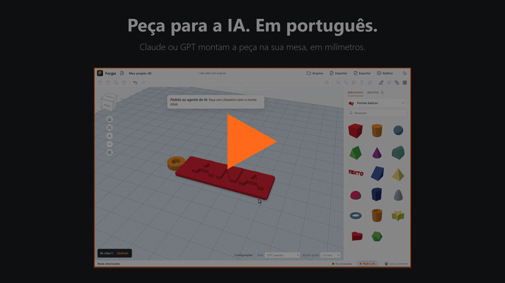</a><br>
  <sub>▶ Clique para assistir ao vídeo (50 s)</sub>
</p>

<p align="center">
  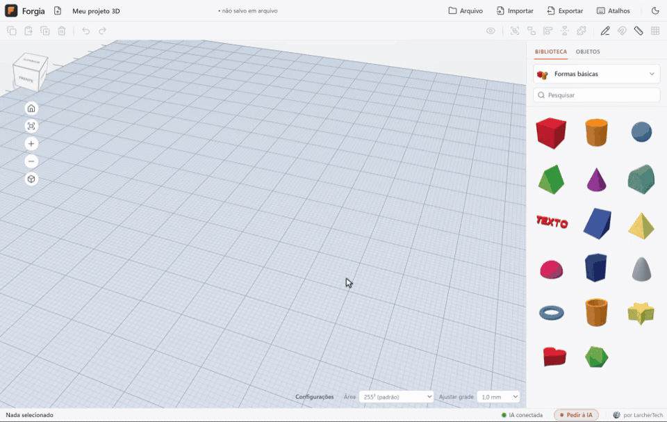
</p>

<p align="center"><sub>Gravação da tela do Forgia com os comandos que a IA (Claude) enviou num teste real para o pedido
“faça um chaveiro com o nome ANA”. A legenda com o pedido foi posta na gravação.
<a href="docs/media/forgia-apresentacao.webm">Ver em vídeo</a>.</sub></p>

<p align="center">
  Funciona com o <b>Claude</b> e com o <b>GPT</b> (pelo Codex): use a sua conta do Claude ou do ChatGPT e peça a peça
  em português. Sem IA, tudo funciona com o mouse. — <a href="#como-usar-a-ia"><i>Como usar a IA</i></a>.
</p>

---

##  Arraste formas e monte sua peça

Caixa, cilindro, esfera, cone, estrela, coração, texto… Arraste da biblioteca para a mesa, uma em
cima da outra, e ajuste **em milímetros**: clique no número da medida e digite. Qualquer forma pode
virar **furo** — ao agrupar, o furo recorta o que estiver em volta.

<p align="center">
  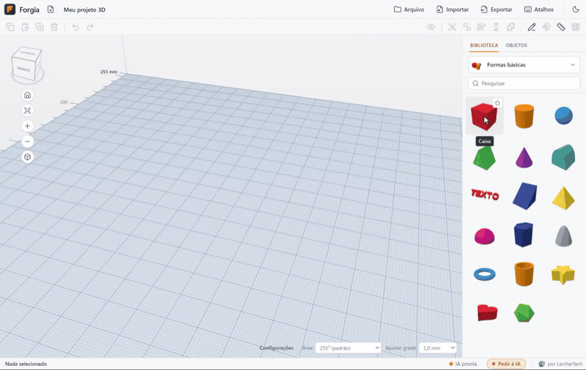
</p>

##  Peça para a IA

Escreva o que quer ("faça um suporte de celular com furo para o cabo") para a IA e ela monta a peça
no Forgia aberto, em milímetros. Tudo o que ela faz num pedido volta com um **Ctrl+Z**. Quer mexer só
num pedaço? Clique em **Pedir à IA**, na barra de baixo, e em **Marcar** (ou aperte **N**): clique na
parte, escreva o pedido e cole na conversa com a IA. Ela sabe exatamente qual parte, o ponto e a face.
<!-- BLOQUEIO DE PUBLICAÇÃO: a frase abaixo (Agent Code / "Pedir à IA") só vai na release pública depois
que houver uma release do Agent Code com a integração (0.1.36 ou mais nova, com os recursos modelo e
imagens). O marcar.gif já é gravado com o Agent Code de verdade. -->
Com o [Agent Code](#como-usar-a-ia) integrado, você nem precisa colar: o Enter do Marcar manda o pedido
direto para a IA, e o pedido e a resposta ficam na conversa do **Pedir à IA**.

<p align="center">
  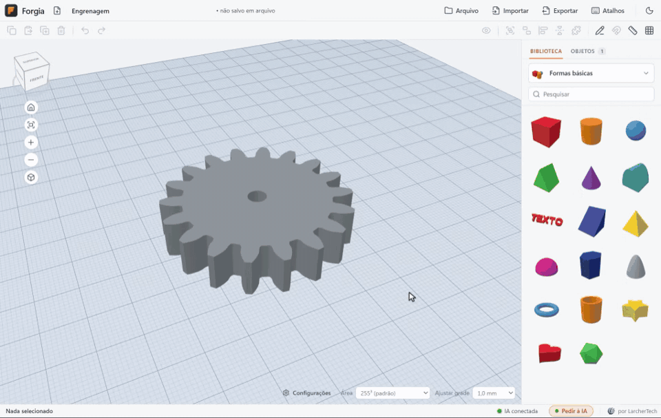
</p>

##  Abra modelos baixados (STL e 3MF)

Baixou um modelo pronto no MakerWorld, Printables ou Thingiverse? Abra no Forgia e adapte: arraste o
arquivo para a janela (ou use **Importar**). Ele abre **STL, OBJ e 3MF**, até projetos do Bambu
Studio e do OrcaSlicer. Depois é como qualquer peça: ponha um nome ao lado, faça um furo, crie um
encaixe. **STL** e **3MF** são os arquivos de peça 3D que os sites e as impressoras usam (o 3MF guarda
também as cores). Um modelo leve abre em uns 2 segundos; um muito detalhado pode levar mais (um
3MF de 22 MB levou uns 20 segundos no nosso teste).

<p align="center">
  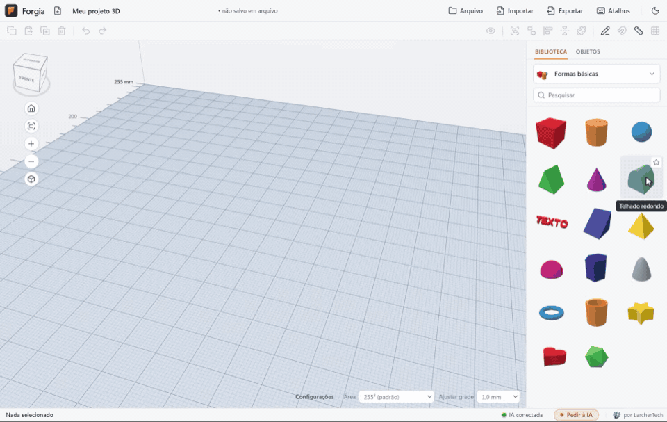
</p>

<p align="center"><sub>Modelo do GIF: esqueleto de <i>Triceratops horridus</i> do
<a href="https://sketchfab.com/3d-models/triceratops-horridus-marsh-e9c507f179ed4455aac3b208c9e6c973">Smithsonian Institution</a>,
em domínio público (CC0); o arquivo está em <a href="docs/media/modelos/triceratops.3mf">docs/media/modelos</a>.</sub></p>

##  Desenhe com o mouse e vire 3D

Aperte **B**, desenhe o contorno na mesa (à mão livre ou clicando ponto a ponto) e ele vira uma peça.
Puxe a alça de cima para dar altura. Bom para plaquinhas, cortadores de biscoito e enfeites.

<p align="center">
  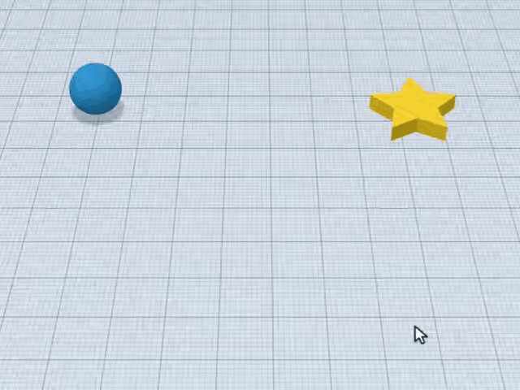
</p>

##  Encaixes com folga, prontos para imprimir

Selecione uma peça e clique em **Criar encaixe**: o Forgia faz ao lado um bloco com o negativo dela,
aberto em cima, com a folga que você escolher (0,25 mm por padrão). No exemplo, um parafuso M8 vira
um furo do mesmo tamanho, com folga para ele entrar — do mesmo jeito sai um suporte, um soquete ou
uma tampa que entra sem apertar.

<p align="center">
  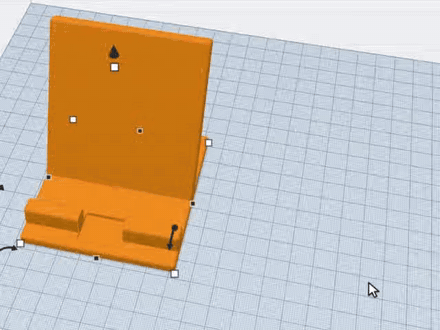
</p>

##  Peça certinha em cima da outra, e régua de verdade

Com o **Cruzeiro** (tecla **C**), a peça desliza pela superfície das outras e gruda alinhada à face,
até em bola e em parede inclinada — sem ficar flutuando nem afundada. A **régua** (tecla **R**) mede
de ponto a ponto, grudando em cantos, meios de aresta e centros de furo. E a própria mesa tem régua
nas bordas, do zero ao tamanho da sua impressora: com uma peça selecionada, ela mostra a largura
que a peça ocupa.

<p align="center">
  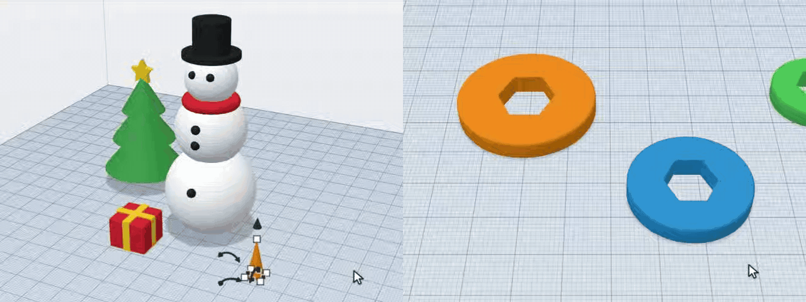
</p>

##  Do Forgia para a impressora

**Exportar** gera o `.STL` (o formato que todo fatiador abre) ou o `.3MF` com **as cores e as peças
separadas**. O **fatiador** é o programa que prepara a impressão (Bambu Studio, OrcaSlicer,
PrusaSlicer, Cura): é nele que você abre o arquivo e manda imprimir. Numa impressora Bambu com
**AMS** (o sistema que troca os filamentos para imprimir em várias cores), cada cor do 3MF vira um
filamento que você escolhe no Bambu Studio.

<p align="center">
  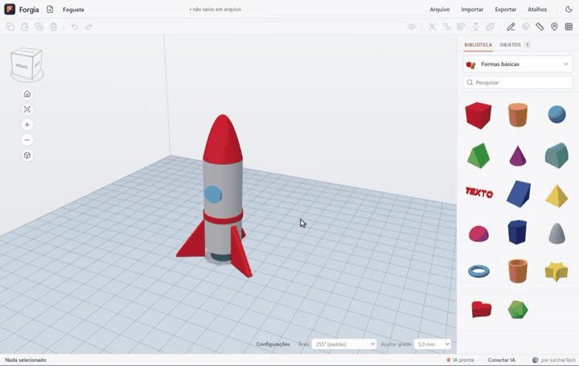
</p>

---

##  E tem mais

| | |
| --- | --- |
|  **A mesa da sua impressora** | Bambu A1/P1, A1 mini, Prusa, Ender 3 ou a medida que você digitar, no seletor **Área**. |
|  **Tema claro e escuro** | Segue o Windows, ou escolha no botão de sol e lua. |
|  **Dicas com vídeo** | Pare o mouse num botão e veja, num vídeo curto, o que ele faz. |
|  **Porcas, parafusos e furos prontos** | De M2 a M8, com rosca real ou lisa, furo para parafuso (com bolsão de porca) e furo para inserto (a peça de latão com rosca que se crava a quente no plástico). |
|  **Geradores** | Engrenagem, grade, mola, dobradiça, texto curvo e caixa com tampa, por parâmetros. |
|  **Iniciantes e Suas criações** | Peças prontas para começar e as suas, guardadas para reusar. |
|  **Plano de trabalho** | Transforme a face de uma peça no chão, até inclinada, e monte em cima dela. |
|  **Projeto em arquivo** | Salve em `.forgia` (Ctrl+S), com cópia de segurança automática. |
|  **Desfazer** | Ctrl+Z e Ctrl+Y em tudo, inclusive no que a IA fez. |
|  **Lista de objetos** | Todas as peças e partes, com olho para esconder e cadeado para travar. |
|  **Sem conta e offline** | Seus projetos ficam no seu computador; nada vai para a nuvem. |

---

<a id="comece-em-1-minuto"></a>

##  Comece em 1 minuto

1. **Baixe** o [`Forgia-Setup.exe`](../../releases/latest/download/Forgia-Setup.exe) (Windows 10 e 11, 64 bits).
2. **Abra o instalador.** Como ele ainda não é assinado digitalmente, o Windows pode mostrar o aviso
   azul **“O Windows protegeu o computador”**. Clique em **Mais informações** e depois em
   **Executar assim mesmo**:

   <p align="center">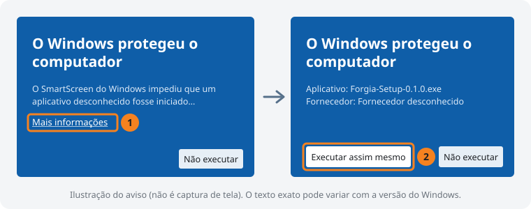</p>

3. **Escolha a mesa da sua impressora** no seletor **Área**, no canto de baixo da tela (ou deixe a
   padrão, de 255 mm).
4. **Arraste uma forma** da biblioteca (à direita) para a mesa e mude a medida clicando no número.
5. **Exporte**: botão **Exportar → .STL** (ou **.3MF**, para manter as cores).
6. **Abra no seu fatiador** — Bambu Studio, OrcaSlicer, PrusaSlicer ou Cura — e mande imprimir.

Todas as ferramentas e atalhos estão no [guia de uso](docs/guia-de-uso.md).

<a id="como-usar-a-ia"></a>

##  Como usar a IA

**Conectar a IA é muito fácil:** copie um texto no Forgia, cole no seu agente e pronto. Ele mesmo faz
a ligação. Veja com o Claude, gravado da tela de verdade:

<p align="center">
  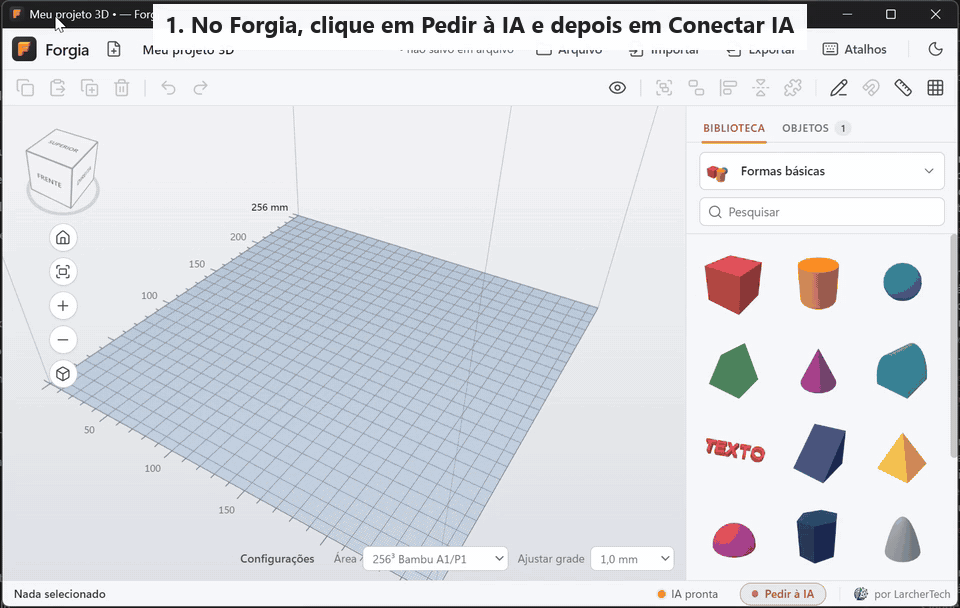
</p>

**O que é um agente de IA.** É um programa no seu computador que conversa com você. Ligado ao Forgia,
ele monta as peças na tela: você pede em português, ele cria e altera, e tudo o que ele faz aparece
na hora e pode ser desfeito.

**Qual usar.** O **Claude** ou o **GPT**, pelo **Codex**. Também funcionam o
Cursor e outros agentes compatíveis (opção **Outro**). O ChatGPT e o Gemini abertos no navegador não
se ligam ao Forgia: precisa ser um desses programas, no mesmo computador.

**Quanto custa.** O Forgia não cobra nada e não pede chave de IA: quem conversa é o agente, com a
sua conta. Com o Forgia, o Claude exige um plano pago
([Pro ou Max](https://support.claude.com/en/articles/11145838-use-claude-code-with-your-pro-or-max-plan)).
O Codex vem nos planos Plus, Pro, Business e Enterprise do ChatGPT
([ajuda da OpenAI](https://help.openai.com/en/articles/11369540-using-codex-with-your-chatgpt-plan)).

**Passo a passo.**

1. Clique em **Pedir à IA**, na barra de baixo do Forgia, e em **Conectar IA**, no alto da conversa.
2. Escolha o seu agente (**Claude**, **Codex**, **Cursor** ou **Outro**) e clique em **Copiar**.
3. Cole o texto numa conversa com o agente. Ele instala a ligação com o Forgia sozinho e pede licença
   para mudar a configuração dele — é esperado.
4. Numa conversa nova, peça, por exemplo, "faça um cubo de 20 mm".

Ao atualizar o Forgia, faça de novo: o texto sai com as pastas da versão nova.

<!-- BLOQUEIO DE PUBLICAÇÃO: a parte "integrado, recebe os pedidos direto do Forgia" só vai na release
pública depois que houver uma release do Agent Code com a integração (testada de ponta a ponta com o
Agent Code 0.1.36 local). -->
Prefere uma janela de chat em vez do terminal? O [Agent Code](https://github.com/MatheusLarcher/agent-code),
do mesmo autor, é um app em português para usar o Claude — e, integrado, recebe os pedidos direto do Forgia.

**Veja o passo a passo do seu agente** (clique para abrir):

<!-- BLOQUEIO DE PUBLICAÇÃO: este item só vai na release pública depois que houver uma release do
Agent Code com a integração (o GIF já é gravado com o Agent Code de verdade). -->
<details>
<summary> <b>Agent Code</b>: integrar e pedir aqui mesmo, sem copiar e colar</summary>
<p align="center">
  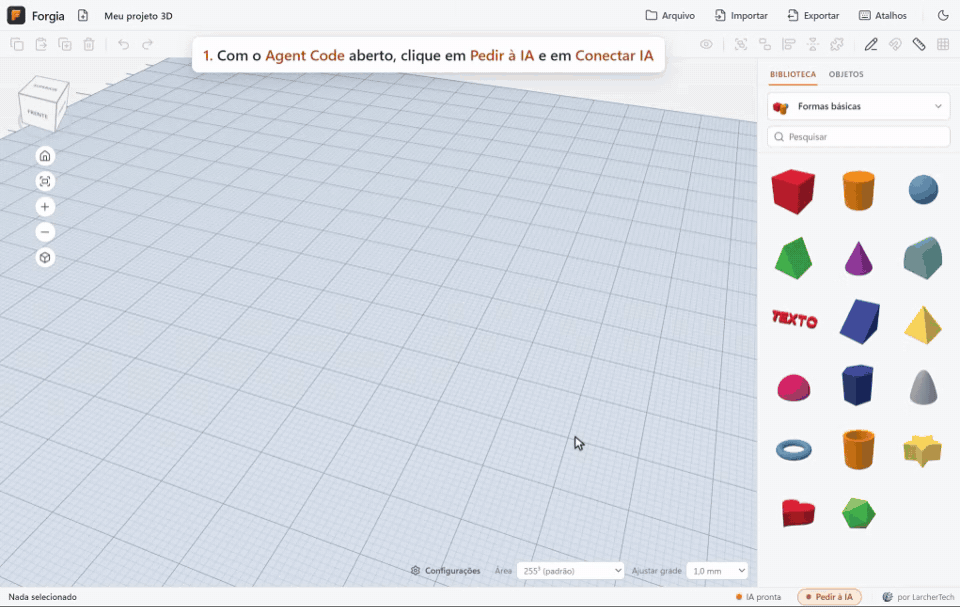
</p>
</details>

<details>
<summary> <b>Codex</b> (GPT)</summary>
<p align="center">
  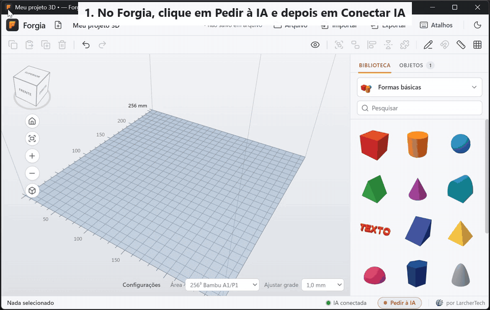
</p>
</details>

<details>
<summary> <b>Outro</b> programa de IA com MCP</summary>
<p align="center">
  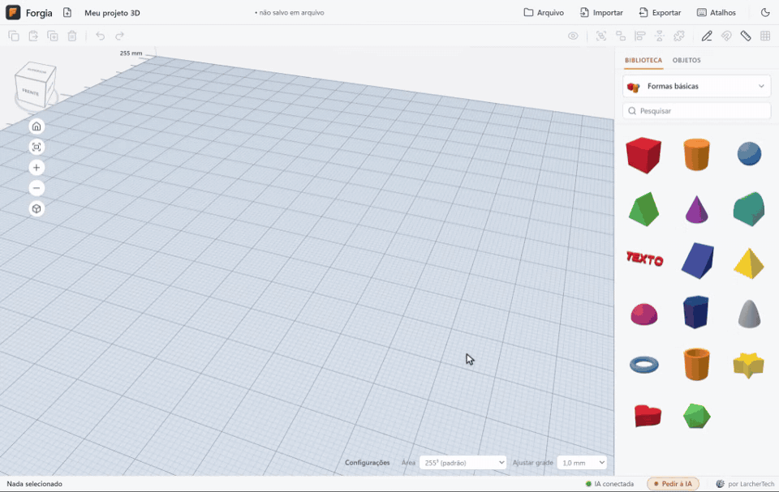
</p>
</details>

##  Perguntas de quem está começando

<details>
<summary><b>Preciso ter uma impressora 3D?</b></summary>

Para desenhar, não: o Forgia funciona sozinho. Para imprimir, use a sua impressora ou um serviço de
impressão 3D: você manda o arquivo `.STL` e recebe a peça pronta.

</details>

<details>
<summary><b>O que é STL?</b></summary>

É o arquivo com o formato da peça: só a superfície, feita de triângulos, sem cor. Todo programa de
impressão 3D abre. O **3MF** é a versão moderna: guarda também as cores e as peças separadas.

</details>

<details>
<summary><b>O que é fatiador?</b></summary>

É o programa que transforma a peça em camadas e caminhos do bico da impressora (o arquivo que a
impressora entende). O Forgia **desenha** a peça; o fatiador (Bambu Studio, OrcaSlicer, PrusaSlicer,
Cura) **prepara a impressão**: suportes, preenchimento, temperatura.

</details>

<details>
<summary><b>Funciona com a minha impressora?</b></summary>

Sim, se o fatiador dela abre STL ou 3MF (praticamente todos abrem). O seletor **Área** já traz as
mesas da Bambu A1/P1, A1 mini, Prusa e Ender 3; para outra, escolha **Personalizado…** e digite as
medidas.

</details>

<details>
<summary><b>Posso abrir um modelo que baixei da internet?</b></summary>

Pode: o Forgia abre **STL, OBJ e 3MF**, inclusive projetos salvos no Bambu Studio e no OrcaSlicer.
Arraste o arquivo para a janela ou use **Importar**.

</details>

<details>
<summary><b>É grátis mesmo? Precisa de conta ou de internet?</b></summary>

É grátis e de código aberto (licença MIT). Não precisa de conta nem de internet: os projetos ficam no
seu computador e nada é enviado.

</details>

<details>
<summary><b>A IA é paga?</b></summary>

O Forgia não cobra pela IA, mas o agente usa a sua conta: com o Forgia, o Claude exige um plano pago
(Pro ou Max), e o Codex vem nos planos Plus, Pro, Business e Enterprise do ChatGPT. Sem IA, tudo
funciona com o mouse. Veja [Como usar a IA](#como-usar-a-ia).

</details>

<details>
<summary><b>Funciona no Mac ou no Linux?</b></summary>

Ainda não: por enquanto, só Windows 10 e 11 (64 bits).

</details>

<details>
<summary><b>O Windows mostrou um aviso azul. É perigoso?</b></summary>

O aviso aparece porque o instalador ainda não tem assinatura digital. O código do Forgia é
aberto, aqui no GitHub, para quem quiser conferir. Clique em **Mais informações** e em **Executar
assim mesmo** (veja [Comece em 1 minuto](#comece-em-1-minuto)).

</details>

<details>
<summary><b>É parecido com o Tinkercad?</b></summary>

Sim, o jeito de montar é o mesmo: formas prontas, sólido e furo, agrupar. O Forgia roda no seu
computador, até sem internet, e traz porcas e parafusos prontos, 3MF com cores e IA.

</details>

<details>
<summary><b>Serve no lugar do Fusion 360 ou do FreeCAD?</b></summary>

Não. O Forgia monta peças com formas prontas, como brinquedo de encaixar; não é um programa de
desenho técnico, com esboços cotados e restrições.

</details>

<details>
<summary><b>Que folga usar num encaixe?</b></summary>

Para uma peça entrar na outra numa impressora de filamento comum, **0,2 a 0,3 mm de cada lado**
costuma funcionar — o Forgia usa **0,25 mm** por padrão. Encaixe apertado (que precisa de força):
0,1 a 0,15 mm. Encaixe bem solto: 0,4 mm ou mais. Na dúvida, imprima um teste pequeno antes.

</details>

<details>
<summary><b>Por que a peça precisa estar apoiada na mesa?</b></summary>

A impressora constrói de baixo para cima, camada sobre camada. O que fica flutuando no ar não tem onde
se apoiar e vira fio solto. Deixe a face maior encostada na mesa: selecione a peça e aperte
**Shift+D** (Soltar na mesa). Partes muito inclinadas ou em balanço podem precisar de suporte no
fatiador.

</details>

##  Ajuda

Esta é a primeira versão pública, e pode ter erro. Achou um problema ou ficou com dúvida?
[Abra uma issue](../../issues/new/choose) (a conta no GitHub é grátis). Diga a versão do Forgia (ela
aparece em **Configurações**) e, se puder, mande um print da tela.

---

##  Para devs

Electron 33 + JavaScript puro (módulos ES, sem framework de interface), [three.js](https://threejs.org)
para o 3D, [three-bvh-csg](https://github.com/gkjohnson/three-bvh-csg) para os furos (CSG) e Vite
para o build. A IA fala com o Forgia por um servidor MCP escrito à mão, que roda pelo próprio
`Forgia.exe` e chega ao programa aberto por uma ponte local (HTTP em 127.0.0.1); cada pedido vira um
lote, um passo de desfazer. A integração com o Agent Code usa MCP por HTTP local.

```bash
npm install
npm run dev          # desenvolvimento no navegador, com recarga automática
npm run dist:win     # instalador do Windows em release/
npm run gravar-dicas # regrava os vídeos das dicas a partir dos roteiros
```

O `gerar_setup.bat` gera o `release\Forgia-Setup.exe` e sobe a versão sozinho a cada instalador.

- [docs/arquitetura.md](docs/arquitetura.md) — como o código está organizado.
- [docs/build.md](docs/build.md) — build, instalador, versão e como regravar as dicas e as mídias deste README.
- [docs/guia-de-uso.md](docs/guia-de-uso.md) — todas as ferramentas e atalhos.
- Testes: `node --test tests/*.test.mjs` e `npm run test:branding`; os do programa gerado, com
  `FORGIA_EXE=release\…\win-unpacked\Forgia.exe` (lista em [docs/arquitetura.md](docs/arquitetura.md#testes)).

Ícones da interface: [Lucide](https://lucide.dev) (licença ISC; aviso em [THIRD-PARTY-NOTICES](THIRD-PARTY-NOTICES)).

---

<p align="center">
  <a href="https://larchertech.com/"></a><br>
  <sub>Feito no Rio de Janeiro por um carioca · © <a href="https://larchertech.com/">LarcherTech</a> · <a href="LICENSE">MIT</a></sub>
</p>
