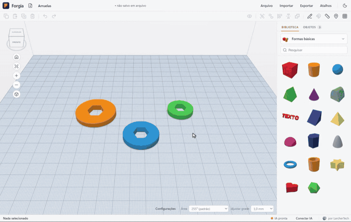

<h1 align="center">
  <br>
  Forgia
</h1>

<p align="center">
  <b>Da ideia à peça.</b>
</p>

<p align="center">
  Um programa para Windows, em português, para quem quer <b>imprimir em 3D</b> sem ser engenheiro:<br>
  você monta a peça com formas prontas, em milímetros, pede ajuda à IA se quiser e manda para a impressora.
</p>

<p align="center">
  
  
  
  
  
</p>

<p align="center">
  
</p>

<p align="center"><sub>Reprodução dos comandos que o agente de IA (Claude Code) enviou numa sessão real de teste para o pedido
“faça um chaveiro com o nome ANA”: o mesmo lote, pela mesma ponte local, gravado da tela do próprio Forgia.
A legenda com o pedido foi posta na gravação. <a href="docs/media/forgia-apresentacao.webm">Ver em vídeo</a>.</sub></p>

---

##  Arraste formas e monte sua peça

Caixa, cilindro, esfera, cone, estrela, coração, texto… Arraste da biblioteca para a mesa, uma em
cima da outra, e ajuste **em milímetros**: clique no número da medida e digite. Qualquer forma pode
virar **furo** — ao agrupar, o furo recorta o que estiver em volta.

<p align="center">
  
</p>

##  Desenhe com o mouse e vire 3D

Aperte **B**, desenhe o contorno na mesa (à mão livre ou clicando ponto a ponto) e ele vira uma peça.
Puxe a alça de cima para dar altura. Bom para plaquinhas, cortadores de biscoito e enfeites.

<p align="center">
  
</p>

##  Peça certinha em cima da outra, e régua de verdade

Com o **Cruzeiro** (tecla **C**), a peça desliza pela superfície das outras e gruda alinhada à face,
até em bola e em parede inclinada — sem ficar flutuando nem afundada. A **régua** (tecla **R**) mede
de ponto a ponto, grudando em cantos, meios de aresta e centros de furo.

<p align="center">
  
</p>

##  Peça para a IA

Escreva o que quer ("faça um suporte de celular com furo para o cabo") no seu agente de IA e ele
monta a peça no Forgia aberto, em milímetros, como um passo só — um **Ctrl+Z** desfaz tudo. Quer
mexer só num pedaço? **Marcar parte** (tecla **N**): clique na parte, escreva o pedido e cole no
agente. Ele sabe exatamente qual parte, o ponto e a face.

<p align="center">
  
</p>

##  Encaixes com folga, prontos para imprimir

Selecione uma peça e clique em **Criar encaixe**: o Forgia faz ao lado um bloco com o negativo dela,
aberto em cima, com a folga que você escolher (0,25 mm por padrão) — para imprimir um suporte, um
soquete ou uma tampa que entra sem apertar.

<p align="center">
  
</p>

##  Do Forgia para a impressora

**Exportar** gera o `.STL` (o formato que todo fatiador abre) ou o `.3MF` com **as cores e as peças
separadas** — no Bambu Studio, cada cor vira um grupo para o AMS. Depois é abrir no seu fatiador
(Bambu Studio, OrcaSlicer, PrusaSlicer, Cura) e imprimir.

<p align="center">
  
</p>

---

##  E tem mais

| | |
| --- | --- |
|  **Tema claro e escuro** | Segue o Windows, ou escolha no botão de sol e lua. |
|  **Dicas com vídeo** | Pare o mouse num botão e veja, num vídeo curto, o que ele faz. |
|  **Porcas, parafusos e furos prontos** | De M2 a M8, com rosca real ou lisa, furo para parafuso (com bolsão de porca) e furo para inserto. |
|  **Geradores** | Engrenagem, grade, mola, dobradiça, texto curvo e caixa com tampa, por parâmetros. |
|  **Iniciantes e Suas criações** | Peças prontas para começar e as suas, guardadas para reusar. |
|  **Plano de trabalho** | Transforme a face de uma peça no chão, até inclinada, e monte em cima dela. |
|  **Projeto em arquivo** | Salve em `.forgia` (Ctrl+S), com cópia de segurança automática. |
|  **Desfazer** | Ctrl+Z e Ctrl+Y em tudo, inclusive no que a IA fez. |
|  **Lista de objetos** | Todas as peças e partes, com olho para esconder e cadeado para travar. |
|  **Sem conta e offline** | Seus projetos ficam no seu computador; nada vai para a nuvem. |

---

##  Comece em 1 minuto

1. **Baixe** o `Forgia-Setup-0.1.0.exe` na página de [Releases](../../releases).
2. **Abra o instalador.** Como ele ainda não é assinado digitalmente, o Windows pode mostrar o aviso
   azul **“O Windows protegeu o computador”**. Clique em **Mais informações** e depois em
   **Executar assim mesmo**:

   <p align="center"></p>

3. **Arraste uma forma** da biblioteca (à direita) para a mesa e mude a medida clicando no número.
4. **Exporte**: botão **Exportar → .STL** (ou **.3MF**, para manter as cores).
5. **Abra no seu fatiador** — Bambu Studio, OrcaSlicer, PrusaSlicer ou Cura — e mande imprimir.

##  Conectar com a IA

Você não precisa saber nada de programação. Clique em **Conectar IA** (na barra de baixo), escolha o
seu agente — **Agent Code, Claude Code, Codex, Cursor** ou outro — e cole o texto que o Forgia gera na
conversa com ele. O agente faz a instalação sozinho. Daí em diante, é só pedir: ele cria e altera
peças no Forgia aberto, e tudo o que ele faz aparece na tela e pode ser desfeito. O Forgia não cobra
nada e não usa chave de IA: quem conversa é o agente que você já usa, no seu computador.

<p align="center">
  
</p>

<p align="center"><sub>Na gravação, o texto aparece borrado porque mostra os caminhos de pastas deste computador.</sub></p>

##  Perguntas de quem está começando

<details>
<summary><b>O que é STL?</b></summary>

É o arquivo com o formato da peça: só a superfície, feita de triângulos, sem cor. Todo programa de
impressão 3D abre. O **3MF** é a versão moderna: guarda também as cores e as peças separadas.

</details>

<details>
<summary><b>O que é fatiador?</b></summary>

É o programa que transforma a peça em camadas e caminhos do bico da impressora (o arquivo que a
impressora entende). O Forgia **desenha** a peça; o fatiador (Bambu Studio, OrcaSlicer, PrusaSlicer,
Cura) **prepara a impressão**: suportes, preenchimento, temperatura.

</details>

<details>
<summary><b>Que folga usar num encaixe?</b></summary>

Para uma peça entrar na outra numa impressora de filamento comum, **0,2 a 0,3 mm de cada lado**
costuma funcionar — o Forgia usa **0,25 mm** por padrão. Encaixe apertado (que precisa de força):
0,1 a 0,15 mm. Encaixe bem solto: 0,4 mm ou mais. Na dúvida, imprima um teste pequeno antes.

</details>

<details>
<summary><b>Por que a peça precisa estar apoiada na mesa?</b></summary>

A impressora constrói de baixo para cima, camada sobre camada. O que fica flutuando no ar não tem onde
se apoiar e vira fio solto. Deixe a face maior encostada na mesa: selecione a peça e aperte
**Shift+D** (Soltar na mesa). Partes muito inclinadas ou em balanço podem precisar de suporte no
fatiador.

</details>

---

##  Para devs

Electron 33 + JavaScript puro (módulos ES, sem framework de interface), [three.js](https://threejs.org)
para o 3D, [three-bvh-csg](https://github.com/gkjohnson/three-bvh-csg) para os furos e Vite para o
build. A IA fala com o Forgia por um servidor MCP escrito à mão, que roda pelo próprio `Forgia.exe`.

```bash
npm install
npm run dev          # desenvolvimento no navegador, com recarga automática
npm run dist:win     # instalador do Windows em release/
npm run gravar-dicas # regrava os vídeos das dicas a partir dos roteiros
```

- [docs/arquitetura.md](docs/arquitetura.md) — como o código está organizado.
- [docs/build.md](docs/build.md) — build, instalador e como regravar as dicas e as mídias deste README.
- [docs/guia-de-uso.md](docs/guia-de-uso.md) — todas as ferramentas e atalhos.
- Testes: `node --test tests/*.test.mjs` e `npm run test:branding`; os do programa gerado, com
  `FORGIA_EXE=release\…\win-unpacked\Forgia.exe` (lista em [docs/arquitetura.md](docs/arquitetura.md#testes)).

Ícones da interface: [Lucide](https://lucide.dev) (licença ISC; aviso em [THIRD-PARTY-NOTICES](THIRD-PARTY-NOTICES)).

---

<p align="center">
  <a href="https://larchertech.com/"></a><br>
  <sub>Feito no Rio de Janeiro por um carioca · © <a href="https://larchertech.com/">LarcherTech</a> · <a href="LICENSE">MIT</a></sub>
</p>
